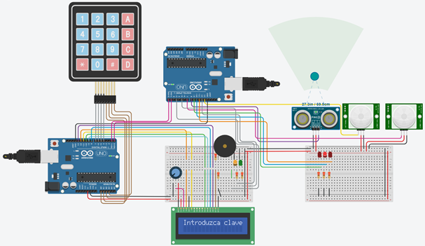

# KamikazeProject

## Objetivos ##

### Objetivo General ###

Elaborar un Sistema Domótico enfocado en la seguridad del hogar con ayuda de microcontroladores Arduino, modulos LCD y Teclado Matricial, sensores de proximidad y movimiento (PIR y Ultrasónico), lenguaje de programación C++ y plataformas profesionales  para trabajo colaborativo como GitHub y Tinkercad. 

### Objetivos Específicos  ###

- Aplicar y reforzar los conocimientos adquiridos en diversas asignaturas ofertadas en la Ing. Sistemas Computacionales relacionadas con el tema de microprocesadores y microcontroladores como Principios Eléctricos y Aplicaciones Digitales, Arquitectura de Computadoras, Lenguajes de Interfaz y Sistemas Programables. 
- Implementar aplicaciones computacionales para solucionar problemas de diversos contextos, integrando diferentes tecnologías, plataformas o dispositivos.  
- Diseñar e implementar interfaces y tecnologías para la automatización de sistemas de hardware y desarrollo del software asociado de forma efectiva.
- Coordinar y participar en equipos multidisciplinarios para la aplicación de soluciones innovadoras que ataquen problemáticas de la vida cotidiana. 
- Comprender qué es y cómo funciona el Internet de las Cosas en conjunto con Sensores y Actuadores. 

## Competencias Adquiridas ##

### Competencias Generales ###

- Capacidad para abstraer, analizar, sintetizar, organizar y planificar un proyecto.
- Habilidad para buscar, analizar y clasificar información proveniente de fuentes diversas. 
- Toma de decisiones y solución de problemas de forma colaborativa.
- Capacidad para generar ideas nuevas e innovadoras.
- Capacidad para comunicarse de forma oral y escrita por medios electrónicos. 
- Capacidad para actuar de forma proactiva y productiva ante imprevistos. 
- Capacidad de aplicar los conocimientos en la práctica.
- Búsqueda del logro.

### Competencias Específicas  ###

- Conoce e identifica los componentes y el funcionamiento de diferentes modelos de arquitectura. 
- Identifica los requerimientos de Hardware y realiza un Proyecto de Electrónica en base a ello. 
- Aplica principios físicos y comprende transductores y sensores. 
- Analiza y sintetiza la función de diversos sensores y sus aplicaciones.
- Aplica principios teóricos de electromagnetismo para analizar actuadores.  
- Identifica y diferencia los actuadores eléctricos, mecánicos e hidráulicos.
- Ensambla los circuitos respectivos empleando sensores y actuadores.  
- Identifica las características eléctricas de un microcontrolador.  
- Conoce la arquitectura interna del microcontrolador.  
- Comprende la estructura de registros del microcontrolador.  
- Analiza dispositivos de entrada/salida y puertos del microcontrolador. 
- Utiliza lenguajes ensamblador o de alto nivel como C++ en la programación del microcontrolador.  
- Programa microcontroladores utilizando puertos de E/S.  
- Construye y comprueba circuitos con microcontrolador. 
- Identifica y analiza los elementos esenciales de los puertos y buses de comunicación.  
- Implementa aplicaciones que impliquen el manejo de puertos y buses de comunicación. 

## Problemática  ##

Hoy en día son cada vez más las personas que necesitan instalar un sistema de seguridad en sus hogares, sin embargo muchos de estos van más allá de la clásica cámara de vigilancia y agregan tecnologías IoT como la inteligencia artificial y machine learning, permitiendo la comunicación de dispositivos y sistemas a través de internet como lo son aplicaciones o software especializado, sensores y actuadores. Debido a que se trata de tecnologías relativamente nuevas e innovadoras su costo puede dispararse y ser claramente inaccesibles para aquel público que vive en condiciones de pobreza o en áreas geográficas con altos índices de inseguridad. 

Además, ya que la demanda de estos servicios aumenta, resulta congruente observar que su precio también, esto no sucede porque los servicios esten escaseando como podría llegarse a creer habitualmente, sino que cuando los precios de casi todos los bienes y servicios suben y siguen aumentando debido a un incremento en la cantidad de dinero en circulación, se entiende que la gente tiene más dinero para gastar y va a demandar más productos, y si la cantidad de bienes y servicios en el mercado es la misma, los precios van a seguir elevándose, dado que la cantidad ofrecida no ha aumentado para abastecer el incremento en la demanda.

Tan solo en el 2018 se calculó que el 41.9% de la población mexicana vivía en situación de pobreza, es decir, cerca de 52.4 millones de personas, y desgraciadamente en la mayoría de los casos la delincuencia está estrechamente relacionada con la pobreza, de hecho, tras la llegada del COVID-19 se pudo notar como la cantidad de robos y saqueos a propiedades privadas aumentaron porque muchas personas se quedaron sin trabajo, y por consiguiente, sin dinero para poder subsistir, teniendo que llegar a ciertos extremos. 

Es por ello que la vía mas económica y rápida para poder obtener un sistema de seguridad en estos tiempos de crisis económica y emergencia sanitaria es haciéndolo uno mismo con el material que se tenga a la mano y sin la necesidad de tener demasiados conocimientos sobre electrónica. En nuestro equipo optamos por un sistema domótico construido con componentes relativamente económicos y accesibles, ya que se venden en grandes cantidades tanto en tiendas físicas como en línea y resulta casi imposible que alguna persona no pueda llegar a adquirirlos. También es un sistema completamente modificable y adaptable, teniendo la posibilidad tanto estudiantes, docentes como público en general de emplearlo en el sitio que crea más conveniente o agregarle más funcionalidades si se desea.

## Introducción ##

### ¿Por qué Estudiar y Utilizar Arduino? ###

Arduino es una plataforma de software libre fácil de usar, que permite a los alumnos construir y programar sus propios proyectos. El “37-In-1 Sensor Kit for Arduino” ofrece una amplia variedad de componentes y sensores que permiten conectar el mundo físico con el virtual, desarrollando la concentración y las habilidades manuales. Con Arduino no solo se aprende a programar, sino que también se motiva al alumno a pensar creativamente, analizando situaciones y aplicando el pensamiento crítico y habilidades para resolver problemas reales.

La robótica educativa, dentro de los colegios, nos proporciona una forma creativa de utilizar y comprender las nuevas tecnologías, la posibilidad de implementar soluciones basadas en ingenio y destreza, dejando de ser solamente consumidores.

La Plataforma de Arduino mantiene una posición muy cercana al mundo de la educación, y es de gran uso en los cursos de Secundaria y Bachillerato. Aprender es fácil y, como es habitual, la clave es dar con todas esas webs con recursos, guías y tutoriales para ir avanzando en el aprendizaje de esta plataforma de electrónica. Pero no se trata solo de un proyecto tecnológico, es mucho más, detrás de él existe una comunidad en movimiento y expansión, que incluye programadores, artistas, educadores, científicos, estudiantes, entre muchos otros y que inspira la filosofía de la cultura libre, permitiendo compartir experiencias y resolver problemas vía online. 

### ¿Cuales son los Beneficios de la Robótica en el Aula? ###

Durante el desarrollo de esta asignatura se aprenderá a utilizar una placa Arduino, el entorno de programación y un kit de desarrollo.

En educación pueden diferenciarse dos tipos de uso de la programación y la robótica como apoyo en clase: por un lado, la robótica y la programación educacional, que consiste en un elemento físico o presencial que motiva a los estudiantes a construir, programar y razonar de manera lógica; por otro lado, la programación y la robótica como elemento social, utilizándolo como actividad recreativa o hobbie. 

En referencia al primer tipo de uso, el educacional, las tecnologías de la programacion y robotica son especialmente beneficiosas en la enseñanza de asignaturas como la ciencia, tecnología, ingeniería y matemáticas. Sin embargo, resulta desfavorable centrarse solo en el uso como herramientas de enseñanza en estas materias y no ser también desplegadas para otras asignaturas que permitan utilizarlas como elementos de socialización.

Otro beneficio en el uso de estas herramientas sería en el caso de alumnos con necesidades especiales, tanto en las áreas cognitivas como psicosociales. La potencialidad de las propuestas educativas basadas en robots lo hacen especialmente útil en programas de refuerzo y de educación especial por el tipo de motivación que ofrecen al usuario. 

Estamos convencidos de que los dispositivos tangibles aumentan el nivel de comprensión debido a que los estudiantes están manipulando las cosas en un plano real. Sin embargo, podemos encontrar alumnos que prefieren trabajar con dispositivos no tangibles. Por lo tanto, lo que parece lógico es un enfoque híbrido entre robótica y programación, donde una fusión entre lo físico y lo virtual proporcione más flexibilidad a los docentes y estudiantes. 

La principal suposición de este enfoque es que la interacción con robots puede reforzar los procesos educativos y mejorar los resultados, tales como el aprendizaje conceptual y el entrenamiento cognitivo, motivar a los estudiantes, apoyar la curiosidad y aumentar la conciencia sobre la robótica.

La metodología empleada pretende fomentar las capacidades del alumnado, estimulando la investigación, la observación y la imaginación, así como el hábito de trabajo individual y en equipo. Se procura fomentar actitudes humanísticas como la curiosidad, empatía e integridad, mediante contenidos específicos, actividades y experiencias prácticas. Algunos de estos contenidos contribuyen a la consolidación de varias competencias.

La idea del proyecto surgió debido a la gran inseguridad por la que está cruzando nuestro país actualmente, y que por desgracia, se ha ido agudizando por la crisis sanitaria, económica y social del COVID-19 que ha traído consigo mayores incidencias de robos y saqueos, por ello es que hoy más que nunca el mercado de los sistemas de seguridad tienen muchisimas mas solicitudes y por lo tanto tienden a un crecimiento económico exponencial. También se considera el hecho de que uno de estos sistemas especializados puede ser demasiado costoso y no estar al alcance de todo el público que llegase a necesitarlo, dándose a entender que la solución más viable es realizar uno propio con el material más económico que se pueda encontrar en el mercado, esto en lo que se tienen los ingresos suficientes para adquirirlo con un proveedor de servicios de seguridad. 

En base a estos criterios se llegó a la conclusión de que el proyecto elaborado cumple con características de Domótica, es decir, aquel sistema capaz de automatizar una vivienda o edificación de cualquier tipo, aportando servicios de gestión energética, seguridad, bienestar y comunicación, y que puede estar integrado por medio de redes interiores y exteriores de comunicación, cableadas o inalámbricas, y cuyo control goza de cierta ubicuidad, desde dentro y fuera del hogar. En pocas palabras, se podría definir como la integración de la tecnología en el diseño inteligente de un recinto cerrado. 

Nos hemos basado principalmente en tutoriales de YouTube e Instructables y a partir de ahí hemos ido mejorando la idea e incorporando más cosas. 

Después de escoger este proyecto y avanzar bastante en la codificación, hemos encontrado en YouTube circuitos muy parecidos al que deseábamos realizar, como por ejemplo,[ el que se presenta aquí.](https://www.youtube.com/watch?v=dRCnccv_dVE)

<p align="center">

</p>

Como se puede apreciar en la imagen anterior la diferencia más notoria es que en ese proyecto se incorporan cámaras en lugar de utilizar Sensores PIR y de Ultrasonidos. A pesar de ello, la idea general de cómo disponer los elementos en el circuito eléctrico para el proyecto final la hemos sacado de ese video. 

## Descripción del Proyecto ##

Este proyecto tiene como objetivo elaborar una alarma doméstica junto con un sistema de detección de intrusos que permita avisar al usuario de la intromisión de agentes externos en su domicilio. 

La realización de dicho proyecto se ha llevado a cabo por un equipo compuesto de 4 integrantes y se ha dividido en 5 prácticas:

- **Práctica 1:** Módulo Sensor Ultrasónico.
- **Práctica 2:** Módulo Sensor PIR.
- **Práctica 3:** Montaje de Ambos Sensores.
- **Práctica 4:** Teclado Matricial y Pantalla LCD.
- **Práctica 5:** Conexión de 2 Arduinos UNO.

El desarrollo de las prácticas y su unificación conforman el proyecto final, cumpliendo con el objetivo que se perseguía y permitiendo que los miembros del equipo trabajen de forma autónoma en cada parte. 

El funcionamiento de la alarma doméstica permitirá realizar configuraciones en el dispositivo para poder ejecutar varias acciones como: 

1. Activar Alarma Completa.
2. Activar ½ Alarma.
3. Cambiar de Contraseña.

Más adelante se explicará a detalle en qué consisten cada una de estas funciones. 

## Tecnologías y Materiales Empleados  ##

A pesar de que más adelante se explicará qué tipos de materiales se han utilizado y cómo se van integrando al circuito, aquí incluimos a modo de resumen la lista de todos aquellos que hemos empleado para llevar a cabo nuestro proyecto final:

- 2 Arduino UNO.
- 2 Protoboard.
- 3 LEDs Rojos.
- 1 LED Verde.
- 1 LED Amarillo.
- 1 Buzzer.
- 1 KeyPad 4x4.
- 1 LCD 16x2.
- 7 Resistencias de 220 Ω.
- 1 Potenciómetro de 250 kΩ.
- 1 Módulo de Sensor Ultrasonico HC-SR04.
- 2 Sensores PIR HC-SR501.
- Cables de Conexión.
- Cables de Hembra a Macho DuPont.
- Alimentación: Ordenador o PowerBank con Conexión para 2 Puertos USB.

También hemos empleado las siguientes plataformas:

- **Desarrollo:**
  1. Arduino IDE.
  2. Tinkercad Circuits.
- **Investigación:**
  1. Instructables.
  2. YouTube.
  3. StackExchange.
  4. StackOverflow.
  5. Hackaday.
  6. Hackster.
  7. Arduino Project Hub.
- **Comunicación (Trabajo Colaborativo):**
  1. Google Meet.
  2. Google Docs.
  3. Google Drive.
  4. Discord.
  5. Facebook Messenger.
  6. GitHub.
  7. Trello.

## Costos ##

|                 Material                | Precio Individual | Precio Total |                  Fuente                 |
|:---------------------------------------:|:-----------------:|:------------:|:---------------------------------------:|
|              2 Arduino UNO.             |      $549.00      |   $1,098.00  |             [Arduino UNO Rev3](https://www.amazon.com.mx/Arduino-Org-A000066-R3-microcontrolador-a000066/dp/B008GRTSV6/ref=sr_1_6?__mk_es_MX=%C3%85M%C3%85%C5%BD%C3%95%C3%91&keywords=Arduino+UNO&qid=1590637262&sr=8-6)            |
|              2 Protoboard.              |       $67.21      |    $134.42   |             [Mini Protoboard](https://www.steren.com.mx/mini-protoboard-de-1-bloque-y-2-tiras.html)             |
|              3 LEDs Rojos.              |       $2.40       |     $7.20    |             [LED Rojo de 5 mm](https://www.steren.com.mx/led-de-5-mm-color-rojo-claro.html)            |
|               1 LED Verde.              |       $2.40       |     $2.40    |            [LED Verde de 5 mm](https://www.steren.com.mx/led-de-5-mm-color-verde-claro.html)            |
|             1 LED Amarillo.             |       $2.40       |     $2.40    |           [LED Amarillo de 5 mm](https://www.steren.com.mx/led-de-5-mm-color-ambar-claro.html)          |
|                1 Buzzer.                |       $39.21      |    $39.21    |              [Buzzer Pasivo](https://www.steren.com.mx/buzzer-pasivo.html)              |
|              1 KeyPad 4x4.              |       $38.40      |    $38.40    |      [Teclado Numérico Matricial 4x4](https://www.steren.com.mx/teclado-numerico-matricial-4-x-4.html)     |
|               1 LCD 16x2.               |       $63.21      |    $63.21    |             [Display LCD 16x2](https://www.steren.com.mx/display-lcd-2x16.html)            |
|         7 Resistencias de 220 Ω.        |       $1.60       |     $11.2    |         [Resistencia de 220 Ohms](https://www.steren.com.mx/resistencia-de-carbon-de-1-watt-al-5-de-tolerancia-de-220-ohms.html)         |
|        1 Potenciómetro de 250 kΩ.       |       $20.00      |    $20.00    |        [Potenciómetro de 250 kOhms](https://articulo.mercadolibre.com.mx/MLM-654191642-potenciometro-con-escala-y-perilla-250k-ohm-_JM?quantity=1#position=3&type=item&tracking_id=8b4be561-1f1f-4a78-80cf-669f609bf916)       |
| 1 Módulo de Sensor Ultrasonico HC-SR04. |       $47.21      |    $47.21    |            [Sensor Ultrasónico](https://www.steren.com.mx/sensor-ultrasonico.html)           |
|         2 Sensores PIR HC-SR501.        |       $63.21      |    $126.42   |         [Sensor de Movimiento PIR](https://www.steren.com.mx/sensor-de-movimiento-pir.html)        |
|           Cables de Conexión.           |       $72.00      |    $72.00    | [Juego de 80 Cables de 15 cm Tipo DuPont](https://www.steren.com.mx/juego-de-80-cables-de-15-cm-tipo-dupont.html) |
|                                         |      **Total:**       |   **$1,662.07**  |                                         |

## Montaje del Proyecto ##

### Practica 1: Sensor Ultrasónico  ###

<p align="center">

</p>

#### Descripción de la Práctica ####

El objetivo principal de esta práctica es aprender a utilizar el módulo sensor de ultrasonido. El sensor de ultrasonido es el responsable de medir distancias para evitar obstáculos.

En lugar de utilizar el sensor de ultrasonido de forma independiente, se han asociado dos led, uno de color rojo y otro de color verde; y un zumbador de sonido (más adelante buzzer). Cuando el sensor detecte movimiento, se encenderá el led rojo y el buzzer emitira sonido. En caso de no detectar movimiento, permanecerá encendido el led de color verde.

#### Material Utilizado ####

- 1 Arduino UNO.
- 1 Protoboard.
- 1 Módulo de Sensor Ultrasonico HC-SR04.
- 1 LED Rojo.
- 1 LED Verde.
- 1 Buzzer.
- 2 Resistencias 220 Ω.
- 9 Cables de Hembra a Macho DuPont.

#### Descripción del Componente ####

El módulo HC-SR04 es un sensor de distancias por ultrasonidos capaz de detectar objetos y calcular la distancia a la que se encuentra en un rango de 2 a 450 cm. El sensor funciona por ultrasonidos y contiene toda la electrónica encargada de hacer la medición. Su uso es tan sencillo como enviar el pulso de arranque y medir la anchura del pulso de retorno.

El sensor incorpora un par de transductores de ultrasonido que se utilizan de manera conjunta para determinar la distancia del sensor con un objeto colocado enfrente de este. La interfaz digital se logra mediante 2 pines digitales: el pin de trigger (disparo) y echo (eco).

1.	El primero recibe un pulso de habilitación de parte del microcontrolador, mediante el cual se le indica al módulo que comience a realizar la medición de distancia.
2.	El segundo Pin (echo) del sensor “muestra” al microcontrolador un pulso cuyo ancho es proporcional al tiempo que tarda el sonido en viajar del transductor al obstáculo y luego de vuelta al módulo.

#### Simulación ####

En este apartado podemos ver la simulación de la práctica en el programa Tinkercad.

En la **imagen 1**, se aprecia que el ultrasonido está encendido y el led está en verde porque no detecta ningún obstáculo en una distancia mayor a 200 cm.

En la **imagen 2**, se aprecia que el ultrasonido y led rojo están encendidos porque se detecta un obstáculo en una distancia igual o inferior a 200 cm. En este caso, el buzzer emite sonido para que se identifique la presencia de un obstáculo.

##### Imagen 1 #####

<p align="center">

</p>

##### Imagen 2 #####

<p align="center">

</p>

#### Código Fuente ####

Después de efectuar el cableado, se abre el programa “IDE de Arduino” y escribimos este código para que la placa Arduino R1 reconozca las diferentes partes de la práctica, e interactúen como se ha descrito anteriormente. Una vez escrito el código lo subimos a la placa y comprobamos que funciona. 

```cpp
int ledPinRojo = 10;
int ledPinVerde = 12;
int pinBuz = 6; 
int ultrasonido = 9;

void setup()
{
    Serial.begin(9600);
    pinMode(ledPinRojo, OUTPUT);
    pinMode(ledPinVerde, OUTPUT);
}

long readUltrasonicDistance(int pin)
{
    pinMode(pin, OUTPUT);
    digitalWrite(pin,LOW);
    delayMicroseconds(2);
    digitalWrite(pin,HIGH);
    delayMicroseconds(10);
    digitalWrite(pin, LOW);
    pinMode(pin, INPUT);
    return pulseIn(pin, HIGH);
}

void loop()
{
    // Leemos la Distancia del Sensor Ultrasónico.
    int cm = 0.01723*readUltrasonicDistance(ultrasonido);
  
    // Si la Distancia es menor a 2 metros, encendemos el Led Rojo y apagamos el Verde.
    // Además, hacemos sonar el Buzzer.
    if (cm < 200)
    {
        tone(pinBuz, 350, 200);
        digitalWrite(ledPinRojo, HIGH);
        Serial.println("Motion detected!");
        digitalWrite(ledPinVerde, LOW);
    }
    else
    {
        // En caso contrario, apagamos el Led Rojo y encendemos el Verde.
        digitalWrite(ledPinRojo, LOW);
        digitalWrite(ledPinVerde, HIGH);
    }
}
```
### Práctica 2: Sensor PIR ###

<p align="center">

</p>

#### Descripción de la Práctica ####

El objetivo principal de esta práctica es aprender a utilizar el módulo sensor PIR. El sensor PIR es el responsable de detectar el movimiento de un objeto. 

En lugar de utilizar el Sensor PIR de forma independiente, se han asociado dos LED (uno de color rojo y otro de color verde) y un buzzer. Cuando el sensor detecte movimiento, se encenderá el LED Rojo y el Buzzer emitira sonido. En caso de no detectar movimiento, permanecerá encendido el LED de color Verde.

#### Material Utilizado ####

-	1 Arduino UNO.
-	1 Protoboard. 
-	1 Sensor PIR.
-	1 LED Rojo.
-	1 LED Verde.
-	1 Buzzer.
-	2 resistencias de 220 Ω.
-	11 Cables de Hembra a Macho DuPont.

#### Descripción del Componente ####

El Módulo PIR HC-SR501, es un sensor electrónico pasivo que mide la luz infrarroja (IR) emitida por los objetos situados en su campo de visión. Se utilizan principalmente en los detectores de movimiento basados en PIR. 

Todos los objetos con una temperatura por encima del cero absoluto emiten calor. Por lo general, esta radiación es invisible para el ojo humano, ya que irradia en longitudes de onda infrarrojas, pero puede ser detectado por dispositivos electrónicos diseñados para tal propósito.

El término pasivo, en este caso, se refiere al hecho de que los dispositivos PIR no generan o irradian cualquier energía para fines de detección. Trabajan en su totalidad para la detección de la energía emitida por otros objetos. Es importante tener en cuenta que los sensores PIR no detectan o miden "calor" sino que detectan la radiación infrarroja emitida por un objeto. Sin embargo, a pesar de ser diferentes, a menudo la radiación infrarroja está asociada a la temperatura del objeto.

El sensor incorpora tres pines de conexión +5V, OUT (3,3v) y GND, y dos resistencias variables de calibración (Ch1 y RL2).

1.	**Ch1:** Esta resistencia permite establecer el tiempo que se va a mantener activa la salida del sensor. Una de las principales limitaciones de este módulo es que el tiempo mínimo que se puede establecer es de más o menos 3s. Si se cambia la resistencia por otra de 100K, puede bajar el tiempo mínimo a más o menos 0,5 s.
2.	**RL2:** Esta resistencia variable permite establecer la distancia de detección, que puede variar entre 0 a 3 metros.

#### Simulación ####

En este apartado podemos ver la simulación de la práctica en el programa Tinkercad. 

En la **imagen 1**, se aprecia que el sensor PIR está encendido y el led está en verde porque no detecta ninguna temperatura. 

En la **imagen 2**, se aprecia que el sensor PIR está encendido y el led está rojo porque detecta una temperatura. En este caso, el buzzer emite sonido para que se identifique la presencia de un cuerpo. 

##### Imagen 1 #####

<p align="center">

</p>

##### Imagen 2 #####

<p align="center">

</p>

#### Código Fuente ####

Después de efectuar el cableado, se abre el programa “IDE de Arduino” y escribimos este código para que la placa Arduino R1 reconozca las diferentes partes de la práctica, e interactúen como se ha descrito anteriormente. Una vez escrito el código lo subimos a la placa y comprobamos que funciona.

```cpp
int ledR = 10; //led rojo
int ledV = 12; //led verde
int pir = 7; // PIR
int buzzer = 6; //Buzzer

void setup(){
  //iniciación de los sensores leds
  Serial.begin(9600);
  
  pinMode(pir, INPUT_PULLUP);
  pinMode(ledR, OUTPUT);
  pinMode(ledV, OUTPUT);
}

void loop(){
  //Leemos los valores del Sensor PIR
  int proximidad = digitalRead(pir);
  delay(100);
  
  //si detecta movimiento encendemos el led rojo y el buzzer, 
  //luego apagamos el led verde
  
  if (proximidad == HIGH){
    tone(buzzer,350,200);
    digitalWrite(ledR, HIGH);
    Serial.println("Movimiento Detectado!");
    digitalWrite(ledV, LOW);
  }
  else{
    //si no apagamos todo y dejamos encendido el verde :)
    digitalWrite(ledR, LOW);
    digitalWrite(ledV, HIGH);
  }
}
```

### Práctica 3: Integración de Sensores PIR y Ultrasonido ###

#### Descripción de la Práctica ####

El objetivo principal de esta práctica es integrar las dos prácticas anteriores. En lugar de utilizar los sensores de movimiento por separado, queremos hacer que cada uno de los sensores de movimiento tengan un led rojo asociado. Cuando un sensor detecte movimiento, se encenderá su propio led rojo, a modo de indicación para saber cuál es el sensor que está detectando movimiento. Por ello, tenemos 3 sensores y 3 leds rojos. Finalmente, dispondremos de un led verde, que se encenderá si ninguno de los tres sensores están detectando movimiento. 

Esta práctica la hacemos con el objetivo de que luego en nuestro proyecto final seamos capaces de diferenciar en qué habitación de la casa están los intrusos. 

#### Material Utilizado ####

-	1 Arduino UNO.
-	1 Protoboard.
-	2 Sensores PIR.
-	1 Sensor de Ultrasonido.
-	3 LEDS Rojos.
-	1 LED Verde.
-	1 Buzzer
-	4 Resistencias de 220 Ω.

#### Simulación ####

En este apartado podemos ver la simulación de la práctica en el programa Tinkercad. La primera imagen muestra la simulación con todos los sensores desactivados salvo el LED verde, que indica que no se están detectando intrusos en el sistema:

<p align="center">

</p>

La siguiente imagen muestra la simulación cuando dos de los sensores están detectando intrusos. Como podemos ver, dos de los leds rojos están activados a modo indicativo: 

<p align="center">

</p>

#### Código Fuente ####

```cpp
int ledPinRojo = 8 ;
int ledPinRojo2 = 10;
int ledPinRojo3 = 11;
int ledPinVerde = 12;
int pirPin = 7;
int pirPin2 = 13;
int pinBuz = 6;
int ultrasonido = 9;

void setup()
{
  Serial.begin(9600);
  pinMode(pirPin, INPUT_PULLUP);
  pinMode(pirPin2, INPUT_PULLUP);
  
  pinMode(ultrasonido, INPUT);
  
  pinMode(ledPinRojo,OUTPUT);
  pinMode(ledPinRojo2,OUTPUT);
  pinMode(ledPinRojo3,OUTPUT);
  pinMode(ledPinVerde,OUTPUT);
  
}

long readUltrasonicDistance( int pin)
{
pinMode(pin,OUTPUT);
digitalWrite(pin,LOW);
delayMicroseconds(2);

digitalWrite(pin,HIGH);
delayMicroseconds(10);
digitalWrite(pin,LOW);
pinMode(pin,INPUT);
  
return pulseIn(pin,HIGH);

}

bool intrusos = false;

void loop()
{
  bool desactivado = false;
  
  int proximity = digitalRead(pirPin);
  delay(100);
  
  int proximity2 = digitalRead(pirPin2);
  delay(100);
  
  int cm = 0.01723 * readUltrasonicDistance(ultrasonido);
  Serial.println(cm);
  
if(proximity == HIGH)
  {
  
  tone(pinBuz, 350,200);
  digitalWrite(ledPinRojo, HIGH);
  Serial.println("Motion detected");
  digitalWrite(ledPinVerde,LOW);
  intrusos = true;
  
  }
  else
  {
  digitalWrite(ledPinRojo,LOW);
    desactivado = true;
  }
  
  if(proximity2 == HIGH)
  {
  tone(pinBuz, 350,200);
  digitalWrite(ledPinRojo3, HIGH);
  Serial.println("Motion detected");
  digitalWrite(ledPinVerde,LOW);
  intrusos = true;
  desactivado = false;
  }
  
  else
  {
  digitalWrite(ledPinRojo3,LOW);
  }
    
    if(cm < 200){
      tone(pinBuz, 350,200);
      digitalWrite(ledPinRojo2, HIGH);
      Serial.println("Motion detected");
      digitalWrite(ledPinVerde, LOW);
      intrusos = true;
    }
   else
   {
     digitalWrite(ledPinRojo2 , LOW);
     
     if(desactivado == true) 
     {
     intrusos = false;
     }
   }
  
      if(intrusos == false) 
      {
      digitalWrite(ledPinVerde , HIGH);
      }
      
    }
```

### Práctica 4: Pantalla LCD 16x2 y KeyPad 4x4 ###

<p align="center">

</p>

#### Descripción de la Práctica ####

El objetivo principal de esta práctica es aprender a utilizar periféricos de entrada y salida de datos. Para ello utilizaremos un teclado matricial como dispositivo de entrada, el cual permitirá la introducción de claves numéricas, y una pantalla LCD como dispositivo de salida, donde se mostrará al usuario una serie de instrucciones y los números que el usuario haya introducido. 

Al inicio, tendremos programada una clave numérica, un led rojo encendido, y se mostrará por la pantalla LCD un mensaje el cual indique al usuario que el sistema se encuentra a la espera de que introduzca una clave. Cuando el usuario introduzca una clave numérica, la cual se mostrará por la pantalla, podrán ocurrir 2 estados:

1.	**Clave Numérica Incorrecta:** Se mostrará un mensaje por la pantalla LCD que indique dicho estado y un buzzer producirá un sonido distintivo para este estado. 
2.	**Clave Numérica Correcta:** Se mostrará un mensaje por la pantalla LCD que indique dicho estado, se apagará el led rojo y se encenderá el led verde, y un buzzer producirá un sonido distintivo para este estado. 

Esta práctica la hacemos con el objetivo de que luego en nuestro proyecto final seamos capaces de interactuar con el sistema de control de la alarma. 

#### Material Utilizado ####

-	1 Arduino UNO.
-	1 Protoboard.
-	1 Keypad 4x4.
-	1 LCD 16x2.
-	1 LED Rojo.
-	1 LED Verde.
-	1 Buzzer.
-	4 Resistencias de 220 Ω.
-	1 Potenciómetro 250 kΩ.

#### Descripción del Componente ####

Un teclado matricial es un dispositivo que agrupa los pulsadores en filas y columnas, formando una matriz, y permite controlarlos empleando un número de conductores inferior al que necesitaríamos al usarlos de forma individual. 

La pantalla LCD (Liquid Crystal Display) muestra información en una pantalla gracias a la iluminación del fondo. Para ajustar dicha iluminación suele ser necesario el uso de un potenciómetro que permita regular la resistencia entre la placa Arduino y el LCD. La pantalla que utilizaremos en esta práctica es de 16x2, es decir, tiene 2 filas de 16 caracteres cada una. 

#### Simulación ####

En este apartado podemos ver la simulación de la práctica en el programa Tinkercad. La primera imagen muestra la simulación del sistema a la espera de que el usuario introduzca una clave:

<p align="center">

</p>

**Estado 1:** Introducción de Clave Numérica Incorrecta

<p align="center">


</p>

**Estado 2:** Introducción de Clave Numérica Correcta (2255)

<p align="center">

</p>

#### Código Fuente ####

```cpp
//Librerías necesarias
#include <LiquidCrystal.h>
#include <Keypad.h>
/*---------------------KEYPAD---------------------------*/
const byte numRows=4;//Número de filas
const byte numCols=4;//Número de columnas
char keypressed;
char keymap[numRows][numCols]=
{
  {'1','2','3','A'},
  {'4','5','6','B'},
  {'7','8','9','C'},
  {'*','0','#','D'},
};

//Conexiones entre el teclado y los terminales de arduino
byte rowPins[numRows]={7,6,A5,A4};//Filas de 0 a 3
byte colPins[numCols]={A3,A2,A1,A0};//Columnas de 0 a 3

Keypad myKeypad = Keypad(makeKeymap(keymap), rowPins, colPins, numRows, numCols);
/*--------------------FIN KEYPAD-----------------------*/
/*--------------------LCD------------------------------*/
LiquidCrystal lcd(8,9,10,11,12,13);//Pines (rs,eb,d4, d5, d6,d7)

//Resolución de la pantalla
int screenWidth = 16;
int screenHeight = 2;
/*--------------------FIN LCD-------------------------*/

char codigoSecreto[4] = {'2','2','5','5'};//Clave numerica
//Variables de comparación entre clave introducida y programada
int posicion=0;
int clave=0;

int cursor=5; //Posición de introducción de datos en el LCD

//Declaración de variables auxiliares
int ledRojo=2;
int ledVerde=3;
int buzzer=4;

void setup()
{
  //Inicializamos los leds y el buzzer
  pinMode(ledRojo, OUTPUT);
  pinMode(ledVerde, OUTPUT);
  pinMode(buzzer, OUTPUT);
  
  digitalWrite(ledRojo,HIGH);//Encendemos el LED rojo
  digitalWrite(ledVerde,LOW);//Apagamos el LED verde
  
  //Inicializamos el LCD
  lcd.begin(screenWidth, screenHeight);
  lcd.clear();//Borramos
  lcd.setCursor(0,0);//Situamos el cursor en la línea 1
  lcd.print("Introduzca clave");//Escribimos
  lcd.setCursor(cursor,1);//Situamos el cursor en la línea 2
}

void loop()
{
 char pulsacion = myKeypad.getKey();//Leemos la pulsación
 if(pulsacion!=0)//Si hemos pulsado
 {
   if(pulsacion != '#' && pulsacion != '*' && clave == 0)//Y no ha sido # (almohadilla) ni * (asterisco)
   {
     lcd.print(pulsacion);//Escribimos la pulsación
     cursor++;//Incrementamos la posición del cursor
     //Tono de pulsación
     tone(buzzer,350);
     delay(200);
     noTone(buzzer);
     
     if (pulsacion == codigoSecreto[posicion])//Si la pulsación se corresponde con la clave
     {
       posicion ++;//Incrementamos la posición a comparar
     }
     if (posicion == 4)// Si todas las pulsaciones coinciden con la clave
     {
       lcd.clear();//Borramos
       lcd.setCursor(0,0);//Situamos el cursor en la línea 1
       lcd.print("Clave correcta");//Escribimos
       //Tono de clave correcta
       delay(2000);
       tone(buzzer,500);
       delay(100);
       noTone(buzzer);
       tone(buzzer,600);
       delay(100);
       noTone(buzzer);
       tone(buzzer,800);
       delay(100);
       noTone(buzzer);
       
       clave=1;//Indicador de clave correcta
       
       digitalWrite(ledRojo,LOW);//Apagamos el LED rojo
       digitalWrite(ledVerde,HIGH);//Encendemos el LED verde
     }
     if(cursor>8)//Si hemos pulsado 4 números
     {
       //Inicializamos las variables
       cursor=5;
       posicion=0;
       if(clave==0)//Y la clave no es correcta
       {
         lcd.clear();//Borramos
         lcd.setCursor(0,0);//Situamos el cursor en la línea 1
         lcd.print("Clave incorrecta");//Escribimos
         //Tono de clave incorrecta
         tone(buzzer,70,500);
         delay(250);
         noTone(buzzer);
         delay(1500);
         lcd.clear();//Borramos
         lcd.setCursor(0,0);//Situamos el cursor en la línea 1
         lcd.print("Introduzca clave");//Escribimos
         lcd.setCursor(5,1);//Situamos el cursor en la línea 2
       }
     }
   }
 }
  if(pulsacion=='*')//Si pulsamos * (asterisco)
  {
    //Inicializamos las variables 
    posicion =0;
    cursor=5;
    clave=0;
    posicion=0;
    
    lcd.clear();//Borramos
    lcd.setCursor(0,0);//Situamos el cursor en la línea 1
    lcd.print("Introduzca clave");//Escribimos
    lcd.setCursor(5,1);//Situamos el cursor en la línea 2
    
    digitalWrite(ledRojo,HIGH);//Encendemos el LED rojo
    digitalWrite(ledVerde,LOW);//Apagamos el LED verde
  }
}
```

### Práctica 5: Conexión entre los dos Arduinos ###

#### Introducción ####

El motivo fundamental por el cual utilizamos dos arduinos parte de la necesidad de utilizar más pines para nuestro proyecto sin hacer cosas excesivamente complicadas. 

Aunque la explicación completa de esto sea algo complicado, vamos a intentar reducirlo para que se entienda la forma de usarlo. 

La idea básica es que exista un **protocolo de comunicación entre los dos arduinos** para que sean capaces de “entender el idioma del otro arduino”. ¿Qué significa esto? 

1.	**Cada arduino tiene que tener su propio código fuente** (archivo .ino distinto). Por tanto, habrá que tener dos instancias de Arduino IDE abiertas y cargar en cada Arduino su código correspondiente. 

>**Nota:** cada vez que se añade un nuevo Arduino en Tinkercad, aparece una nueva pestaña desplegable que te permite ver el código asociado al Arduino que acabamos de añadir. 

2.	**El protocolo de comunicación implica que se va a decidir**, un “idioma” que entenderán los dos arduinos. Este idioma será como un **código** entre ellos para comunicar qué cosas están pasando en su placa. Por ejemplo, puede tener sentido que si tenemos conectado un sensor de ultrasonidos al Arduino número 1, quizás queramos comunicarle a un led que está conectado al Arduino número 2 que tiene que encenderse si se detecta presencia a menos de 1 metro. Se detalla la manera un poco más adelante. 

Pasamos ahora a detallar las conexiones que habrá que realizar entre los dos arduinos para que todo lo anterior sea factible.

#### Detalles de la Conexión Entre los dos Arduinos ####

Nosotros utilizamos la información de [Arduino to Arduino Serial Communication](http://robotic-controls.com/learn/arduino/arduino-arduino-serial-communication) para aprender cómo comunicar nuestros arduinos entre ellos.

Suponemos que nos encontramos en la situación descrita en el punto 2 de la introducción del apartado anterior, donde queremos comunicar un arduino que tiene conectado un sensor de ultrasonidos con un arduino que tiene conectado un led, con la idea de que el led se encienda si se está detectando la presencia de alguien. Para ello, las conexiones que tenemos que realizar son las siguientes:

<p align="center">

</p>

Es decir, tenemos que conectar en serie el pin tx del arduino 1 al pin rx del arduino 2, y el pin tx del arduino 2 al pin rx del arduino 1. 

Adicionalmente, es **MUY importante** que tengan en común un **ground**, tal y como se muestra en la figura. De lo contrario, el proyecto no funcionará. 

#### Ejemplo de Uso ####

Mostramos aquí un ejemplo que ilustra cómo estamos utilizando esto en nuestro proyecto: 

##### Arduino 1 (Envía Información) #####

```cpp
int rx = 0;
int tx = 1;

void setup()
{
  Serial.begin (112500);
  //Inicializa pines UART
  pinMode (rx, OUTPUT);
  pinMode (tx, INPUT);
}

void loop()
{
  byte dataR = 0; //Se manda un 0 por el puerto serial
  // al arduino receptor de información. 
  Serial.print(dataR);
}
```

##### Arduino 2 (Recibe Información) #####

```cpp
int rx = 0;
int tx = 1;

void setup()
{
  Serial.begin (112500);
  //Inicializa pines UART
  pinMode (rx, OUTPUT);
  pinMode (tx, INPUT);
}

void loop()
{
  if(Serial.available() > 0)
  {
    val = Serial.read(); // Lee el siguiente byte
    if (val == '0')
    {
      // Hace algo.
    }
  }
}
```

#### Guía para Descargar el Código en Cada uno de los Arduinos ####

Este apartado es especialmente importante, ya que nosotros tuvimos muchos problemas para conseguir cargar el código en los dos arduinos de forma correcta. 

Los pasos a seguir son los siguientes: 

**Paso previo MUY importante:** Desconectar los cables que unen los pines tx y rx del Arduino. Si están conectados entre sí, el programa nos dará un error y no nos permitirá cargar el código en el Arduino. Una vez desconectados, podemos continuar: 

1.	Conectar el primero de los arduinos al puerto USB del ordenador. 
2.	Abrir Arduino IDE con el código del arduino correspondiente. 
3.	Escoger en Herramientas el tipo de placa y el puerto correspondiente a Arduino:

<p align="center">

</p>

4.	Pinchar en el botón de subir a la placa, que está en la parte superior de la pantalla: 

<p align="center">

</p>

5.	Si hay algún error en el código, revisarlo y modificarlo para que el código sea correcto. 
6.	Si no hay ningún error, ya podemos desconectar nuestro Arduino del ordenador. 
7.	Conectar el segundo de los Arduinos. Si lo conectamos en el mismo puerto, no será necesario volver a repetir el punto 3. Esto es más fácil de hacer así que si conectamos los dos arduinos a la vez, ya que al escoger el puerto sólo se puede escoger uno, y posiblemente no estaremos seguros de cuál es cuál. 
8.	Abrir en Arduino IDE el código correspondiente al segundo de los arduinos. 
9.	Volver a repetir los puntos 3 y 4 si fuera necesario. 
10.	Repetir los puntos 5 y 6. 
11.	Finalmente, volver a conectar correctamente los pines tx y rx de cada uno de los arduinos entre ellos. 
12.	Alimentar el circuito y ¡probar el resultado!

### Proyecto Final: Sistema de Detección de Intrusos ###

#### Contexto ####

Este conjunto de prácticas están pensadas para llevarse a cabo en la asignatura de 5to Semestre de Arquitectura de Computadoras con Serie SCD - 1003 correspondiente a la Ing. Sistemas Computacionales impartida en el Instituto Tecnológico de Tijuana.

En particular, esta asignatura tiene divididos sus temas en cuatro unidades con diversas actividades que permiten conocer el uso de microcontroladores como Arduino. 

Los objetivos concretos de lo que sería la unidad didáctica relativa a Arduino son los siguientes: 

-	El alumno será capaz de comprender el funcionamiento básico de Arduino UNO.
-	El alumno aprenderá a utilizar diferentes sensores para detectar información del entorno.
-	El alumno podrá controlar los leds y un buzzer como indicadores de lo que está pasando en el circuito.
-	El alumno comprenderá cómo las diferentes piezas interactúan entre ellas a través del código.
-	El alumno será capaz de utilizar la pantalla de debug de Tinkercad y del programa Arduino UNO (serial monitor) para mostrar información sobre lo que está pasando en el circuito.

Ahora que hemos dado a conocer el contexto por el que elaboramos este conjunto de prácticas, queda por contestar la siguiente interrogante: ¿por qué elegimos este proyecto en concreto y no otro? Existen varias razones: 

1.	Auge de la Domótica y el uso de Microcontroladores.
2.	Las aplicaciones para dispositivos conectados a internet son amplias (IoT o Internet de las Cosas). 
3.	Una alarma es una aplicación real que llama mucho la atención de aquellos alumnos que apenas se van iniciando en el mundo de la electrónica. Cuanta más utilidad vean en el trabajo que están realizando, más fácil será conseguir motivarlos e implicarlos en el proyecto que se desea elaborar.
4.	En la materia de Arquitectura de Computadoras se enseña a usar actuadores y sensores con arduino. Por lo tanto, un proyecto que es capaz de englobar a todos ellos parece perfecto a modo de conclusión para demostrar y poner en práctica nuestros conocimientos adquiridos durante todo el semestre. Además, este proyecto no es tan complejo, por lo que puede llevarse a cabo por grupos reducidos de alumnos sin problema alguno.

#### Material Utilizado ####

-	1 KeyPad 4x4.
-	2 Arduino UNO.
-	1 Sensor Ultrasónico HC-SR04.
-	2 Sensores PIR HC-SR501.
-	7 Resistencias de 220 Ω.
-	3 LEDs Rojos.
-	1 LED Naranja. 
-	1 LED Verde.
-	1 Buzzer.
-	1 Pantalla LCD 16x2.
-	1 Potenciómetro de 250 kΩ.

#### Diagramas de Flujo ####

A continuación se muestran 4 diagramas de flujo de las 4 partes principales de la práctica: el bucle principal, el diagrama de detección cuando la alarma está activada, el diagrama de detección cuando la alarma está activada parcialmente (media alarma) y el diagrama correspondiente al cambio de contraseña.

##### Diagrama del Bucle Principal #####

<p align="center">

</p>

##### Diagrama de Detección con Alarma Activada #####

<p align="center">

</p>

##### Diagrama de Detección con Alarma Parcialmente Activada #####

<p align="center">

</p>

##### Diagrama de Cambio de Contraseña #####

<p align="center">

</p>

#### Simulación ####

A continuación mostramos las fotos del montaje completo en Tinkercad. La primera foto muestra el montaje con el circuito apagado/desactivado:

<p align="center">

</p>

En la siguiente imagen podemos ver que el led amarillo está encendido, ya que la alarma está activada, el sistema nos está pidiendo la contraseña y además se está detectando una presencia en la habitación “vigilada” por el sensor de ultrasonidos, por lo que el led rojo central está encendido también, alertándonos de la presencia de intrusos. 

<p align="center">

</p>

#### Código Fuente ####

En este apartado se muestra el código resultante que hace funcionar nuestro proyecto. Hay dos códigos diferentes, uno por cada uno de los Arduino UNO que estamos utilizando, ya que como hemos dicho previamente, cada uno de ellos necesita unas “instrucciones” específicas para funcionar y hacer su trabajo. 

##### Arduino 1 #####

```cpp
// mirar https://www.arduino.cc/en/Tutorial/EEPROMWrite
// include the library code:
#include <LiquidCrystal.h>
#include <Keypad.h>

/*This is the Sender arduino*/
#include <EEPROM.h>

int rx = 0;
int tx = 1;

/*-------------------------------KEYPAD---------------------------------------*/
const byte numRows= 4; //number of rows on the keypad
const byte numCols= 4; //number of columns on the keypad
char keypressed;
char keymap[numRows][numCols]=
{
{'1', '2', '3', 'A'},
{'4', '5', '6', 'B'},
{'7', '8', '9', 'C'},
{'*', '0', '#', 'D'},
};

//Code that shows the the keypad connections to the arduino terminals
byte rowPins[numRows] = {7,6,5,4};//Rows 0 to 3
byte colPins[numCols] = {A0,A1,A2,A3};//Columns 0 to 3             
//initializes an instance of the Keypad class
Keypad myKeypad= Keypad(makeKeymap(keymap), rowPins, colPins, numRows, numCols);

/*------------------------ FIN DEL KEYPAD---------------------------------------*/

// initialize the library with the numbers of the interface pins
LiquidCrystal lcd(12, 11, 10, 9, 8, 13);

// LCD Screen Resolution.
int screenWidth = 16;
int screenHeight = 2;

// the two lines
String lineOne, lineTwo;

// reference flags
int stringStart, stringStop, displayMode, i = 0;
int scrollCursor = screenWidth;

String linea1 = "1 Set alarm";
String linea2 = "2 Set 1/2 alarm";
String linea3 = "3 Change passwd";
String linea4 = "4 Manual config";
String linea1Act = "Alarm set";
String linea2Act = "Enter passwd";
bool alarmSet = false;
bool startAlarm = true;

// estados de la alarma
enum State { NONE, ALARM_SET, CHOSEN_ONE, CHOSEN_TWO, CHOSEN_THREE, CHOSEN_FOUR };
State estado;

void changePass();

void setup() {
  // set up the LCD's number of columns and rows:
  lcd.begin(screenWidth, screenHeight);
  
  Serial.begin (112500);  
  //initialize UART pins
  pinMode (rx, OUTPUT);
  pinMode (tx, INPUT);
  
  lcd.clear();
  lcd.setCursor(0,0);     // situamos el cursor el la posición 2 de la linea 0.
  estado = NONE;
}

char codigoSecreto[4] = {'2','2','5','5'}; // Aqui va el codigo secreto
int cursor = 5;
int clave=0; // para el LCD
int posicion=0; // necesaria para la clave

void changePass() {
  bool wrong = false;
  int num1, num2, num3, num4;
  int cont = 0;
  
  lcd.clear();
  lcd.setCursor(0,0);
  lcd.print("New passwd:");
  lcd.setCursor(1,1);
  lcd.print(">>> ");
  
  while(cont < 4) {
    keypressed = myKeypad.getKey(); 

    if (keypressed != 0) //Si el valor es 0 es que no se ha pulsado ninguna tecla
    { // descartamos almohadilla y asterisco
      codigoSecreto[cont] = keypressed;
      lcd.print(keypressed);
      cont++;
    }
  } 
  
  lcd.clear();
  lcd.setCursor(0,0);
  lcd.print("Passwd updated.");
  delay(2000);
  
  // lo guardamos en la eeprom para que la siguiente vez empiece con ese
  EEPROM.write(0, (int)codigoSecreto[0]);
  EEPROM.write(1, (int)codigoSecreto[1]);
  EEPROM.write(2, (int)codigoSecreto[2]);
  EEPROM.write(3, (int)codigoSecreto[3]);
}

void compruebaNumYActua(int num) {  
  if (keypressed == '1') {
    lcd.clear();
    lcd.setCursor(0,0);
    lcd.print("Alarm set!");
    estado = CHOSEN_ONE;
    
    alarmSet = true;
    startAlarm = true;
    
    byte dataR = 1; // lo que le mandamos al otro arduino
    Serial.print(dataR);
    delay(300);
    dataR = 2;
    Serial.print(dataR);
    delay(300);
    
  } else if (keypressed == '2') {
    lcd.clear();
    lcd.setCursor(0,0);
    lcd.print("Half alarm set!"); 
    estado = CHOSEN_TWO;
    
    alarmSet = true;
    startAlarm = true;
    
    byte dataR = 5;
    Serial.print(dataR);
    delay(100);
    
  } else if (keypressed == '3') {
    lcd.clear();
    lcd.setCursor(0,0);
    lcd.print("Changing pass!");
    changePass();
    delay(100);
    estado = CHOSEN_THREE;
    
  } else if (keypressed == '4') {
    lcd.clear();
    lcd.setCursor(0,0);
    lcd.print("You pressed 4!");
    estado = CHOSEN_FOUR;
  }
}

void clearBuffer() {
 //clear out the serial buffer

 byte w = 0;

 for (int i = 0; i < 10; i++)
 {
   while (Serial.available() > 0)
   {
     char k = Serial.read();
     w++;
     delay(1);
   }
   delay(1);
 } 
}

void setupTeclado() 
{
  cursor = 5;
  clave = 0;
  posicion = 0;
  lcd.begin(16,2);      
  lcd.setCursor(0,0);     // situamos el cursor el la posición 2 de la linea 0.
  lcd.print("Introduzca clave"); // escribimos en LCD
  lcd.setCursor(cursor,1); // cursor en la posición de la variable, linea 1
}

void loopTeclado() 
{  
  char pulsacion = myKeypad.getKey() ; // leemos pulsación
  int numPulsaciones = 0;
  if (pulsacion != 0) //Si el valor es 0 es que no se ha pulsado ninguna tecla
  { // descartamos almohadilla y asterisco
    if (pulsacion != '#' && pulsacion != '*' && clave==0)
    { 
      lcd.print(pulsacion); // imprimimos pulsación
      numPulsaciones++;
      cursor++;  
      delay(200);
      
      //--- Condicionales para comprobar la clave introducida -----------
      // comparamos entrada con cada uno de los dígitos, uno a uno
      if (pulsacion == codigoSecreto[posicion]){
        posicion ++; // aumentamos posicion si es correcto el digito
      }
      
      if (posicion == 4)
      { 
        // se han introducido los 4 correctamente
        byte dataX = 0; // lo que le mandamos al otro arduino
        Serial.print(dataX);
        delay(300);
        
        lcd.setCursor(0,0);      // situamos el cursor el la pos 0 de la linea 0.
        lcd.print("Clave correcta  ");         // escribimos en LCD
        delay(300);
        
        dataX = 6; // lo que le mandamos al otro arduino
        Serial.print(dataX);
        delay(300);
        
        //startAlarm = true;
        alarmSet = false; // Disarmed!!!!! lo quitamos!
       
        clave=1; // indicamos que se ha introducido la clave
           
        dataX = 0;
        Serial.print(dataX);
        delay(300);
      } 

      if (numPulsaciones >=4 && posicion != 4) {
         delay(200);
        byte dataR = 3; // lo que le mandamos al otro arduino
         Serial.print(dataR);
         delay(200);
      }

     //--- En el caso de que esté incompleta o no hayamos acertado ----------
     if(cursor>8)        // comprobamos que no pase de la cuarta posición
     {  
       cursor=5;     // lo volvemos a colocar al inicio
       posicion=0;           // borramos clave introducida
       lcd.setCursor(5,1);
       lcd.print("    ");       // borramos la clave de la pantalla
       lcd.setCursor(5,1);
       if(clave==0)         // comprobamos que no hemos acertado
       { 
         delay(100);
         // notificamos al otro arduino del error
         byte dataR = 3; // lo que le mandamos al otro arduino
         Serial.print(dataR);
         delay(100);
         
       }
     }
    }
  } 

 //--- Condicionales para resetear clave introducida -------------
 if (pulsacion == '*')
 { // asterisco para resetear el contador
   posicion = 0;
   cursor = 5;
   clave=0;
   posicion=0;
   lcd.setCursor(0,0); // situamos el cursor el la posición 2 de la linea 0.
   lcd.print("Introduzca clave"); // escribimos en LCD
   lcd.setCursor(5,1);
   lcd.print("    "); // borramos de la pantalla los números
   lcd.setCursor(5,1);
 }
}

void loop() {
  
  int val1, val2, val3, val4;
  
  // leemos la clave que esta guardada
  val1 = EEPROM.read(0);
  val2 = EEPROM.read(1);
  val3 = EEPROM.read(2);
  val4 = EEPROM.read(3);
  
  if (val1 == 0 && val2 == 0 && val3 == 0 && val4 == 0) {
    // guardamos en la eeprom el codigo secreto inicial
    EEPROM.write(0, (int)codigoSecreto[0]);
    EEPROM.write(1, (int)codigoSecreto[1]);
    EEPROM.write(2, (int)codigoSecreto[2]);
    EEPROM.write(3, (int)codigoSecreto[3]);
  }
  
  // leemos la clave que esta guardada
  val1 = EEPROM.read(0);
  val2 = EEPROM.read(1);
  val3 = EEPROM.read(2);
  val4 = EEPROM.read(3);
  
  if (!alarmSet) {
    setup();
    // 1. Activar alarma 
    // 2. Activar alarma (media alarma)
    // 3. Cambiar passwd
    // 4. Configuración manual (activar/desactivar aparatos de uno en uno)

    lcd.clear();
    lcd.setCursor(0, 0);
    lcd.print(linea1);
    lcd.setCursor(0, 1);
    lcd.print(linea2);
    delay(1000);
    lcd.clear();
    lcd.setCursor(0, 0);
    lcd.print(linea2);
    lcd.setCursor(0, 1);
    lcd.print(linea3);
    delay(1000);
    lcd.clear();
    lcd.setCursor(0, 0);
    lcd.print(linea3);
    lcd.setCursor(0, 1);
    lcd.print(linea4);
    delay(1000);
    
    lcd.clear();
    lcd.setCursor(0,0);
    lcd.print("Chosen value: "); 
    lcd.setCursor(0,1);
    lcd.print(">>> ");

    bool wrong = false;
    while(true) {
      keypressed = myKeypad.getKey();   

      if (keypressed != 0) //Si el valor es 0 es que no se ha pulsado ninguna tecla
      { // descartamos almohadilla y asterisco
        if (keypressed != '#' && keypressed != '*' && keypressed <= '4') {   
          lcd.print(keypressed); 
          break;
        } 
        if (keypressed > '4') {
          lcd.clear();
          lcd.setCursor(0,0);
          lcd.print("Wrong value!");
          lcd.setCursor(0,1);
          lcd.print(keypressed);
          lcd.setCursor(1,1);
          lcd.print(" not valid :(");
          wrong = true;
          break;
        }  
      } 
    }

    delay(200);

    // Si el numero es correcto, vemos que tenemos que hacer con el
    if (!wrong) {
      compruebaNumYActua(keypressed);
    } 
    delay(200); 
  }
  else {
    // parte de la alarma */
    if (startAlarm == true) {
      setupTeclado();
      startAlarm = false;
    }
    loopTeclado();
    if (alarmSet == false) {
      delay(200); 
    }
  }
}
```

##### Arduino 2 #####

```cpp
#include <EEPROM.h>

int rx = 0;
int tx = 1;

int buzzer = 5;

// detectores
int ultrasonido = 8; 
int pirPin = 7;
int pirPin2 = 13;

// leds
int ledNaranja = 3;
int ledVerde = 12; 
int ledPinRojoH1 = 9;  
int ledPinRojoH2 = 10;
int ledPinRojoH3 = 11;

byte val; // value read on from the serial port
byte dataR; //it contains the byte read from EEPROM

enum State { NONE, FULL_ALARM, HALF_ALARM, ALARM_SPLIT };
State estado;
long readUltrasonicDistance(int pin);
void loopAlarmaCompleta();
void enciendeMediaAlarma();
void loopMediaAlarma();

void setup()
{ 
  // 112500
  Serial.begin (112500);
  delay(500);
  pinMode(ledNaranja, OUTPUT);
  pinMode(ledVerde, OUTPUT);
  
  pinMode(buzzer, OUTPUT);
  pinMode(ledPinRojoH1, OUTPUT);
  pinMode(ledPinRojoH2, OUTPUT);
  pinMode(ledPinRojoH3, OUTPUT);
  
  pinMode(pirPin, INPUT_PULLUP);
  pinMode(pirPin2, INPUT_PULLUP);
  pinMode(ultrasonido, INPUT);
  
  //initialize UART pins
  pinMode (rx, OUTPUT);
  pinMode (tx, INPUT);
  
  estado = NONE;
}

void apagaBuzzer() {
  noTone(buzzer); 
}
void enciendeLedVerde() {
  digitalWrite(ledVerde, HIGH);  
}
void enciendeLedNaranja() {
  digitalWrite(ledNaranja, HIGH);  
}
void apagaLedVerde() {
  digitalWrite(ledVerde, LOW);  
}
void apagaLedNaranja() {
  digitalWrite(ledNaranja, LOW);  
}
void buzzer1() {
 tone(buzzer,350); 
}
void buzzerClaveCorrecta() {
  delay(200); // tono de clave correcta
  tone(buzzer,500);
  delay(100);
  noTone(buzzer);
  tone(buzzer,600);
  delay(100);
  noTone(buzzer);
  tone(buzzer,800);
  delay(100);
  noTone(buzzer);
}

void buzzerClaveIncorrecta() {
  delay(200); // tono de clave incorrecta
  tone(buzzer,300);
  delay(100);
  noTone(buzzer);
  tone(buzzer,100);
  delay(100);
  noTone(buzzer);
}

void buzzerAlarma() {
  tone(buzzer, 800); // play 400 Hz tone for 400 ms
  delay(200);
  tone(buzzer, 500); // play 800Hz tone for 400ms
  delay(200);
  noTone(buzzer);
}

bool intrusos = false;
bool alarmOn = false;
bool halfAlarmOn = false;

// los tres siguientes solo se activan cuando 
// queremos encender cada habitación por separado
bool hab1On = false;
bool hab2On = false;
bool hab3On = false;

void desactivaDeteccion() {
  digitalWrite(ledPinRojoH1, LOW);
  digitalWrite(ledPinRojoH2, LOW);
  digitalWrite(ledPinRojoH3, LOW);
  apagaBuzzer();
  enciendeLedVerde();
  apagaLedNaranja();
  alarmOn = false;
  halfAlarmOn = false;

}

void loop()
{
  if(Serial.available() > 0)
  {
     val = Serial.read();  //read the next byte

    /*
    0 - enciende led verde
    1 - apaga led verde
    2 - enciende led naranja
    3 - apaga led naranja
    4 - apaga buzzer
    5 - enciende media alarma
    6 - desactiva detección
    7 - activa habitación 1
    8 - activa habitación 2
    9 - activa habitación 3
    10 - change pass (cambio de contraseña)
    */
    if (val == '0') {
      desactivaDeteccion();
    } else if (val == '1') {
      apagaLedVerde();
    } else if (val == '2') {
      enciendeLedNaranja();
      alarmOn = true;
    } else if (val == '3') { 
      buzzerClaveIncorrecta();
    } else if (val == '4') {
      apagaBuzzer();
    } else if (val == '5') {
      enciendeMediaAlarma(); 
    } else if (val == '6') {
      desactivaDeteccion(); 
      // tono de clave correcta?
      buzzerClaveCorrecta();
    } else if (val == '7') {
      // activa hab 1
      hab1On = true;
    } else if (val == '8') {
      // activa hab 2
      hab2On = true;
    } else if (val == '9') {
      // activa hab 3
      hab3On = true;
    }
   
  }  else {
      //buzzerClaveCorrecta();
    }

  if (alarmOn) {
    loopAlarmaCompleta();
  } else if (halfAlarmOn) {
    loopMediaAlarma();
  }
  
  delay(200);   
}

long readUltrasonicDistance(int pin)
{
  pinMode(pin, OUTPUT); // Clear the trigger
  digitalWrite(pin, LOW);
  delayMicroseconds(2);
  // Sets the pin on HIGH state for 10 micro seconds
  digitalWrite(pin, HIGH);
  delayMicroseconds(10);
  digitalWrite(pin, LOW);
  pinMode(pin, INPUT);
  // Reads the pin, and returns the sound wave travel time in microseconds
  return pulseIn(pin, HIGH);
}

void loopAlarmaCompleta() 
{
  bool desactivando = false; // utilizamos el valor desactivando como valor intermedio
  // hasta que no nos informen los dos sensores de que realmente no están detectando
  // a nadie no podemos encender el led verde como que todo está en orden. Tenemos
  // que esperar a que ambos comprueben que no hay nadie para encender el verde
  
  int proximity = digitalRead(pirPin);
  delay(100);
  
  int proximity2 = digitalRead(pirPin2);
  delay(100);
  
  int cm = 0.01723 * readUltrasonicDistance(ultrasonido);  
/*Serial.begin (9600);
delay(300);
Serial.print("cm: ");
    Serial.println(cm);
    delay(300);
Serial.begin (112500);
  */  


  if (proximity == HIGH) // If the sensor's output goes low, motion is detected
  {
    digitalWrite(ledPinRojoH1, HIGH);
    intrusos = true;
  }
  else
  {
    digitalWrite(ledPinRojoH1, LOW);
    desactivando = true;
  }
  
  if (proximity2 == HIGH) // If the sensor's output goes low, motion is detected
  {
    digitalWrite(ledPinRojoH3, HIGH);
    intrusos = true;
    desactivando = false;
  }
  else
  {
    digitalWrite(ledPinRojoH3, LOW);
  }
  
  if (cm < 200) {
    
    digitalWrite(ledPinRojoH2, HIGH);
    intrusos = true;
  }
  else
  {
    digitalWrite(ledPinRojoH2, LOW);
    if (desactivando == true) {
        intrusos = false; 
    }
  }
  
  if (intrusos) {
    buzzerAlarma();
  }
}

void enciendeMediaAlarma() {
  enciendeLedNaranja();
  apagaLedVerde();
  halfAlarmOn = true;
}

// loop media alarma
// equivale al plan nocturno, donde van a estar activados dos de los tres sensores
// no queremos que el de la habitación nos detecte
void loopMediaAlarma() 
{
  bool desactivando = false; // utilizamos el valor desactivando como valor intermedio
  // hasta que no nos informen los dos sensores de que realmente no están detectando
  // a nadie no podemos encender el led verde como que todo está en orden. Tenemos
  // que esperar a que ambos comprueben que no hay nadie para encender el verde
  
  // leemos el pir pin 1
  int proximity = digitalRead(pirPin);
  delay(100);
  
  // leemos el ultrasonido
  int cm = 0.01723 * readUltrasonicDistance(ultrasonido);

/*Serial.begin (9600);
delay(300);
Serial.print("cm: ");
    Serial.println(cm);
    delay(300);
Serial.begin (112500);
*/
  
  if (proximity == HIGH) // If the sensor's output goes low, motion is detected
  {
    //tone(buzzer, 350, 200); 
    digitalWrite(ledPinRojoH1, HIGH);
    intrusos = true;
  }
  else
  {
    digitalWrite(ledPinRojoH1, LOW);
    desactivando = true;
  }

  // comprobamos la distancia al ultrasonidos
  // si es menor de 200 cm, encendemos el led rojo de la 
  // habitación 2
  if (cm < 200) {
   // tone(buzzer, 350, 200); 
    digitalWrite(ledPinRojoH2, HIGH);
    intrusos = true;
  }
  else
  {
    digitalWrite(ledPinRojoH2, LOW);
    if (desactivando == true) {
        intrusos = false; 
    }
  }
  
  if (intrusos) {
    buzzerAlarma();
  }
}
```

## Viabilidad y Escalabilidad ##

Los modelos de sistemas de detección de intrusos en el mercado son cada vez más abundantes, y su objetivo de abarcar varios aspectos de la domótica con el fin de hacer más fácil y segura la vida a los usuarios se encuentra en continua expansión. 

Por ello, la adición de nuevas funcionalidades al sistema es completamente factible. La dirección que parece tomar esta área es la de diseñar sistemas centralizados que permitan al usuario controlar y automatizar numerosas facciones del hogar, tales como: 

-	Control de Persianas y Ventanas.
-	Automatizar el Alumbrado.
-	Automatizar la Calefacción. 
-	Sistema Contra Incendios.
-	Automatización de Electrodomésticos. 
-	etc. 

Por ello, podemos afirmar sin ninguna duda que la domótica, y el proyecto presente en este documento, es escalable. Es posible empezar con cuatro sensores y luego empezar a construir nuestra casa inteligente desde ahí. Las opciones para automatizar una vivienda son muy variadas. 

La domótica doméstica cuenta también con un gran atractivo a su favor: el ahorro energético. La eficiencia energética es una de las grandes metas de la tecnología, y el uso optimizado de su consumo en el hogar se hace posible gracias a la domótica. Esto significa también para el usuario una reducción en el pago de su tarifa eléctrica y de gas.

## Pruebas Realizadas ##

Se han realizado múltiples pruebas para comprobar el funcionamiento del proyecto. Se listan a continuación: 

<p align="center">

</p>

## Posibles Extensiones ##

Creemos que este proyecto tiene bastantes extensiones posibles. Algunas de las que hemos considerado son las siguientes: 

1.	Sería muy interesante añadir a nuestro proyecto interruptores reed. Los reed son interruptores eléctricos activados por un campo magnético. Los colocaríamos en puertas y ventanas para activar nuestra alarma si algún intruso accediera a la casa de alguna forma. 

2.	Tal y como está realizado el proyecto, si nuestros arduinos se quedaran sin alimentación, la alarma fallaría, ya que no hay ningún sistema complementario que proporcione energía. Nos gustaría añadir una batería interna que entrara en funcionamiento cuando la alimentación principal fallara por cualquier motivo. 

3.	Sería interesante también contar con un sistema de protección dentro de la circuitería de la propia alarma, evitando así la manipulación no autorizada. De esta manera, si un intruso quisiese desactivarla (desenchufandola, cortando cables, etc.) la alarma se activaria inmediatamente. 

4.	Adicionalmente, nos gustaría estudiar la posibilidad de que el usuario pueda desactivar la alarma de forma más sencilla, sin necesidad de introducir la clave. Para ello, habría dos opciones: 
   
    1. Crear una aplicación móvil que le permita activar la alarma y desactivarla de forma remota. 
    1. Utilizar un sistema de identificación por RFID (módulo lector RFID-RC522 RF) para desactivar la alarma. 

5.	Se podría añadir un apartado de configuración que permita programar la alarma para un calendario específico, de manera que ésta se conecte y desconecte en las fechas y horas indicadas por el usuario. Aplicando también un encendido y apagado de luces a determinadas horas para simular presencia durante un período en el que no estemos en casa. 

6.	Implementación de una parte de domótica donde, por ejemplo, las luces de la casa se enciendan solas en la habitación en la que está el usuario si la alarma está desactivada pero le estamos detectando. Otra opción sería, por ejemplo, abrir la puerta del garaje o similares, para mejorar la experiencia del usuario. 

## Trabajo Futuro ##

Aparte de las extensiones que se han mencionado previamente, consideramos que el trabajo que se podría llevar a cabo para mejorar o ampliar este proyecto es muy interesante. 

Por un lado, habría que buscar una forma mejor de gestionar la cantidad de sensores que utilizamos (y, por tanto, el número de habitaciones cubiertas con nuestro sistema). Si llegáramos a incluir los interruptores reed en puertas y ventanas, nos quedaríamos sin pines en el arduino, por lo que habría que introducir registros de desplazamiento para solventar el problema. 

Por otro lado, a pesar de que el código está preparado para que la opción 4 de configuración manual funcione (ya que hemos probado algo similar para activar solo media alarma y el funcionamiento sería parecido), no hemos terminado de programar cómo escogería el usuario qué habitaciones y sensores quiere que estén activados. 

Finalmente, nos gustaría poder incorporar una parte domótica más real, como hemos mencionado en el apartado de extensiones. Aunque inicialmente nos planteamos que fuera parte de este proyecto, al final lo hemos descartado por falta de tiempo. El motivo es que hemos considerado más importante mejorar el código que teníamos y también detallar el proceso completo que hemos seguido en este documento para que el proyecto sea completamente reutilizable por otros alumnos o docentes en un futuro. 

## Conclusiones ##

### Acevedo Cardona Adelaid Lesdeymariet ###

Lo que nos llevó a elegir este proyecto por sobre otros es debido a la enorme inseguridad que va en aumento en nuestro país, no es nada raro que los saqueos o robos a mano armada en plena luz del día y dentro de propiedades privadas se presenten de forma constante, al no ser un incidente propio únicamente de la noche o madrugada como hace un par de años atrás, uno debe comenzar a plantearse la idea de tener en su hogar o vehículo un sistema de seguridad que esté funcionando la mayor cantidad de tiempo posible. Por supuesto que esto puede ser muy costoso y más ahora por la oferta y demanda, pues estos servicios tienen cada vez más mercado o clientes interesados en adquirir esta clase de servicios y por consiguiente el precio del producto aumenta, convirtiéndolo aún más inaccesible para la población que vive en condiciones de pobreza y precisamente en localidades con altos índices de criminalidad. Debido a ello la opcion mas economica es realizar uno por cuenta propia con lo más barato que tengamos a la mano y por ello nuestro proyecto no es muy costoso pero si muy funcional y cubre las necesidades más básicas y comunes de los usuarios.   

Para poder elaborarlo fue necesario consultar diversos artículos y tutoriales, ya que lo ideal es tener conocimientos básicos sobre temas como la domótica, IoT, microprocesadores y microcontroladores, sensores y actuadores, lenguaje C++ y uso del Entorno de Desarrollo de Arduino. 

Debido a la contingencia sanitaria del COVID-19 las cosas se complicaron un poco más, puesto que tanto a mis compañeros como a mi se nos dificulto encontrar una plataforma intuitiva y completa que pusiera a nuestra disposición todos los componentes necesarios para la correcta simulación de la idea que teníamos en mente, por suerte descubrimos que Tinkercad era una solución viable, excepto porque esta no tiene Arduino Mega y por esa razón tuvimos que ingeniarnosla usando dos Arduino UNO y comunicandolos por el puerto serial para poder tener toda la cantidad de pines disponibles que exigia el circuito final.  

Otra traba inicialmente fue la comunicacion y organizacion de actividades via online, lo bueno fue que al final se pudo cumplir el objetivo buscado y terminamos todos con muchísimos más conocimientos que antes, no solo de la asignatura en sí, sino que también generales, pues aprendimos a utilizar tecnologías innovadoras que nos permitieron realizar actividades de forma colaborativa y productiva. 

### Encarnacion Ocampo Gustavo ###

Este proyecto se decidió realizar basado en la domótica, específicamente en la rama de seguridad con un sistema de alarma que consiste en la detección de intrusos dentro de una propiedad, además esta se activa o desactiva al momento de ingresar una contraseña. 

La tecnología ha ido avanzando con el tiempo, hace unos cuantos años se pensaba en las computadoras como algo de "ciencia ficción", a los pocos años estas se volvieron realidad con grupos pequeños de personas haciendo sus propios circuitos y vendiendolos a empresas que necesitaban cajas registradoras o realizar cualquier tarea básica, llegando a la actualidad donde las computadoras son un producto que se produce de manera masiva y casi todo el mundo tiene uno en casa.

Lo mismo pasa con la domótica, esta aun se ve como algo de ciencia ficción, pero cada vez se encuentra un poco más al alcance de nuestras manos, aunque uno debe tener el dinero para poder costearse uno de estos sistemas, pero por mientras, estudiantes pueden experimentar con ello con pequeñas prácticas o proyectos como este, donde podemos ver el alcance que tiene e ir mejorando poco a poco esta tecnología. La domótica ya existe, pero no es perfecta, y esto se pudo ver en nuestro proyecto.

### Gallardo Dueñas Carlos Ivan ###

El proyecto consta de un conjunto de sensores que trabajan en conjunto para generar un sistema de alarmas casero,se puede ver que con un par de componentes y sensores se puede generar un proyecto que simula una herramienta bastante útil y que podemos ver en uso. De esta manera podemos ver como funcionan más a profundidad y como van interactuando cada uno de los componentes en conjunto. Con respecto al trabajo en equipo se puede observar como cada circuito hecho realiza una tarea específica que puede realizar algo pero al juntar todos los circuitos se puede obtener una función mucho más grande. 

Con este proyecto se puede observar que para realizar un proyecto como lo es un sistema de alarmas no se necesita de muchos recursos o dinero así como este proyecto hay muchos otros proyectos que se pueden crear con un par de componentes y el conocimiento necesario.

### Victor Manuel Gastelum Coronado ###

El proyecto es una muestra de nuestra capacidad como alumnos, nos permite determinar qué tan avanzados vamos en la comprensión de circuitos electrónicos, en el lado lógico de la información hay una estructura Qué es fácil de entender para cualquier programador ya que no ocupa mucha ciencia sin embargo es necesario practicar un poco más los sistemas electrónicos ya que puede ser problemático sólo aprender el lado lógico del problema. Los datos que se han recabado han funcionado como trampolín para el entendimiento de un circuito mejorando nuestra capacidad de reconocer los elementos al momento de ver los y entender sus funciones y puntos en los que tienen que conectarse, ese fue una de las mejores habilidades que aprendieron durante esta práctica qué es la capacidad de reconocer el sensor al momento y entender su funcionamiento dentro de un circuito

### Portilla Amparan Josue ###

Creo que este proyecto incluye varia información de la que fue adquirida durante el semestre por lo que considero que es muy importante haberlo hecho con dedicación y aprender de el en sus varios componentes, es una buena forma de practicar y aprender cosas nuevas, además de que podría llegar a ser un proyecto que pueda ser ampliado en algún futuro para darle un mayor uso y poder aplicarlo en algún ámbito no escolar.

## Referencias ##

1. [J. Case, Comunicación Serial entre Arduinos.](http://robotic-controls.com/learn/arduino/arduino-arduino-serial-communication)
2. [Rony Misael Paz Juarez, Alarma de Distancia Tinkercad.](https://www.youtube.com/watch?v=dkeoRxhXni4)
3. [Arduino | 37 in 1 Sensors Kit Explained.](https://www.instructables.com/id/Arduino-37-in-1-Sensors-Kit-Explained/)
4. [D. Nedelkovski, Ultrasonic Sensor HC-SR04 and Arduino Tutorial.](http://howtomechatronics.com/tutorials/arduino/ultrasonic-sensor-hc-sr04/)
5. [J. Peng, Arduino Home Security System.](https://www.youtube.com/watch?v=dRCnccv_dVE)
6. [Bitwise Ar - Módulo PIR (Sensor de Movimiento Infrarrojo Pasivo).](https://www.youtube.com/watch?v=eFoa88s6yZY)
7. [Bitwise Ar - Teclado Matricial KeyPad 4x4 y Simple Control de Acceso.](https://www.youtube.com/watch?v=9ligsi5Bgv8)
8. [Bitwise Ar - Módulo LCD 1602A con Librería LiquidCrystal.](https://www.youtube.com/watch?v=JEZiHQY-JPI)
9. [appytechie, Home Alarm System.](https://www.instructables.com/id/HOME-ALARM-SYSTEM/)
10. [barzillialloyd, Arduino Home Security System.](https://www.instructables.com/id/Arduino-Home-Security-System/)
11. S. Fitzgerald and M. Shiloh, Arduino Projects Book. 
12. M. Margolis, Arduino Cookbook. 

## Anexos ##

### Video Explicativo del Proyecto ###

[](https://youtu.be/6_XahT1sUFg "Proyecto Final 'DomesticSecurity' - Alarma Casera con Arduino")

➜ [Enlace del Proyecto en Tinkercad para Simular o Modificar](https://www.tinkercad.com/things/kvNQvMjeGlg)
